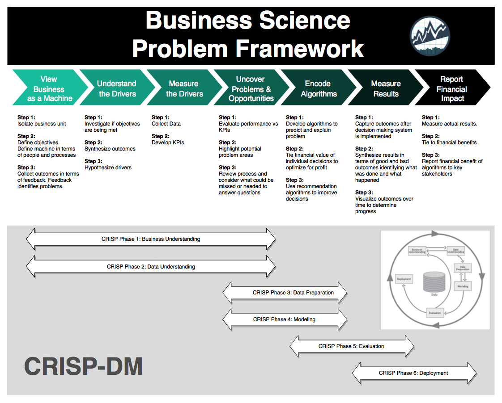

```{r setup, include = FALSE}
# customize output options 
knitr::opts_chunk$set(echo = TRUE, warning = FALSE, message = FALSE,
                      fig.width = 6, fig.asp = 0.618, out.width = "70%", 
                      fig.align = "center")

# libraries used in report
library(knitr)
library(kableExtra)
library(tidyverse)
library(glue)

# set theme for plots
theme_set(theme_minimal(base_family = "Avenir"))

# The palette with grey:
cbPalette <- c("#999999", "#E69F00", "#56B4E9", "#009E73", "#F0E442", 
               "#0072B2", "#D55E00", "#CC79A7")
```

# Introduction 

__Background__

“We are all a little weird and life’s a little weird, and when we find someone whose weirdness is compatible with ours, we join up with them and fall in mutual weirdness and call it love.” - Dr. Suess

I heard this quote recently while attending the wedding of my very good friend. In fact, I will be having my own wedding in less than a year and just went through the process of selecting a venue. Part of the process includes fixed and variable costs that depend on the number of guests that ultimately RSVP to attend the wedding. 

My first question of this process was wondering how many people ultimately respond to wedding invitations. In other words, of the people we invite, how many can we expect to attend? 

As I processed this information, I wondered if there was a better way to quantify the uncertainty of how many people I can expect to attend, and then turn that into an estimate of what my budget will be. Additionally, that estimate can be extended into a risk of going over budget. 

__Objective and Key Result__

+ Objective: Determine a better way to quantify the risk of going over budget

+ Key Result: Develop a model that consumes guest cost inputs and then outputs the risk profile and a recommendation for moving forward. 

I will look to combine elements of statistical simulation, risk analytics, and design thinking to build an analytics product that will extend a single example use-case into a flexible product that others can use. 

# Business Science Problem Framework
```{r echo = FALSE, fig.align = "left"}

```
&nbsp;

We will leverage the Business Science Problem Framework to shape the structure of our analysis and product development. The goal here is to understand the problem, explore potential opportunities, and operationalize the outcomes. 

&nbsp;

## Understand

### 1. View Business as Machine

#### 1.1 Isolate the Business Unit

The "business unit" here is the coupe and their guests. While the costs associated with each guest is based on the wedding vendors, the costs of the wedding are impacted based on the number of guests that are invited and the guests that RSVP _yes_ by the final guest-count cutoff. Inviting too many guests could lead the costs to increase last-minute due to an unexpected amount saying _yes_, which then creates a risk of going over budget to the couple. 

__Example Business Case__

For the sake of the business case, let's assume that `150 people` are on the initial guest invitation list. when taking all the wedding vendors into account, there is a fixed costs of `$22,000` for `50 guests`, and then there is a variable cost of `$125 per guest` above 50. This will be charged at a cutoff point 45 days prior to the date of the wedding, so at this point, the total cost will be known. The couple's budget is `$30,000` and they have a risk tolerance of 25%. In other words, they can stomach a `20%` chance of going over budget and ideally do not want to exceed `$32,000` at the very most. 

```{r}
# number of people invited
invites <- 150

# total budget
budget <- 30000

# risk tolerance
risk_tolerance <- .20

# inputs for total cost calculation
fixed_cost <- 22000
guest_base <- 50
variable_guest_cost <- 125
```

#### 1.2 Define Objectives

The main objective is to quantify the risk of going over a couple faces based on how many people they send invitations to. 

#### 1.3 Collect Outcomes

In doing initial research, the main outcomes of going over budget is underestimating how quickly the costs can climb.

### 2. Understand the Drivers

#### 2.1 Investigate Objectives

The objective at the time invites are sent out are to make sure that all the right people are invitied, but at the same time ensure that unexpected costs do not pop up because too many people RSVP _yes_. 

There are a few drivers that lead to the uncertainty of guest attendance. These factors are the distance to the wedding, cost of of attendance (e.g. hotel & travel), availability of the guest based on the time of year, and the strength of the relationship between the guest and the couple. 

#### 2.2 Synthethize Outcomes

However, there is no historical data to analyze in this instance as the wedding has never happened before. Therefore, it is unknown if the outcomes align with the objectie. Other weddings see a variable amount of response rates (guests with a RSVP of _yes_). This leads to increased uncertainty in the estimates. 

#### 2.3 Hypothethize Drivers

The variability of estimates is likely due to the variability in the factors mentioned above. Additionally, even with historical data to use as a guide, there is natural deviation from an expected response rate as the response rate is the [expected long-run average](https://en.wikipedia.org/wiki/Law_of_large_numbers). The result we see for the actual event is only a single experiment. 

### 3. Measure the Drivers

#### 3.1 Collect Data

Some initial research states [10-20%](https://www.theknot.com/content/dream-solutions-to-your-wedding-guest-list-nightmares) of invitied guests will not attend while another source shows [60-75%](https://www.marthastewartweddings.com/639923/percentage-how-many-guests-attend-wedding) of invited guests will share in the day. In other words, guest attendance rates could be anywhere from 60-90% based on a variety of factors. 

We can use this data to help solve the problem analytically. 

#### 3.2 Develop KPIs

To develop a baseline, we have to figure out how to quanify our risk based on a hypothesis and statistics. The KPIs we focus on will be liklihood of risk, the expected total cost, and the expected value of risk.

We can use the data from our research to calculate baseline KPIs analytically.

To do so, we will make an assumption that there is a universal probability of each guest RVSPing _yes_. This then turns the concept of guests saying yes or no into a [Bernoulli process](https://en.wikipedia.org/wiki/Bernoulli_process). With the law of large numbers, we can then estimate our baseline KPIs based on the expected total number of guests. 

```{r}
# function to calculate total cost
calculate_wedding_cost <- function(fixed_cost, 
                                   variable_guest_cost, 
                                   guest_base, total_guests) {
  # calculate added guest cost
  variable_cost <- variable_guest_cost * (total_guests - guest_base)
  # add to fixed cost
  total_cost <- variable_cost + fixed_cost
  return(total_cost)
}

# function to calculate risk
calculate_risk <- function(budget, total_cost) {
  return(budget - total_cost)
}

# function to recommend action
calculate_recommendation <- function(risk) {
  recommendation <- ifelse(risk >= 0, "Invite All", "Invite Less")
  return(recommendation)
  
}

# given the range from research (60-90%), we pick the middle
p_of_yes <- .75

# probability of yes * total trials
expected_guests <- ceiling(p_of_yes * invites)

# expected total cost
expected_cost <- calculate_wedding_cost(fixed_cost, variable_guest_cost,
                                        guest_base, expected_guests)

# expected risk
expected_risk <- calculate_risk(budget, expected_cost)

# recommendation
expected_recommendation <- calculate_recommendation(expected_risk)

# convert to dataframe for printing
expected_results <- data.frame(total_guests   = expected_guests,
                               total_cost     = expected_cost,
                               total_risk     = expected_risk,
                               recommendation = expected_recommendation)

# print results
kableExtra::kable(expected_results) %>%
  kable_styling(c("striped", "bordered"), full_width = F, position = "left")
```

Using this approach, we see the couple should plan for `r expected_guests` guests to respond and will be under budget by $`r expected_risk`. Using this method, the couple should __`r expected_recommendation`__. 


## Explore

### 4. Uncover Problems and Opportunities

#### 4.1 Evaluate Baseline Performance

While the baseline method is favroable for the couple, it fails to account for the couple's wedding being only a single experiement or trial of the Bernoulli process. The total cost may sometimes be lower, sometimes be higher, or sometimes the same as our analytical calculations. 

#### 4.2 Highlight Potential Problem Areas

The biggest opportunity will be to use simulation to replicate the experiment thousands of times and then analyze the frequency of outcomes. We also can add flexibility to the process by allowing a distribution of probabilities to be sampled for each replication. In other words, we can account for the 60-90% uncertainty range. Another option would be to have different categories of guests and assign each group a different probability.  

#### 4.3 Review Process

To summarize, we will attempt to model a Bernoulli process to generate data to simulate wedding guest invites. We will use a uniform distribution to sample guest probabilities provided from the research. This assumes that the expert guess for probability is accurate enough, so the biggest opportunity for improvement lies in using real data to improve the inputs. 

This method is a simplified version of the real-world process, but should provide added value over the analytically calculated alternative. 

### 5. Encode Algorithms

#### 5.1 Develop Algorithms

We need a few additional functions to piece together our data generating process.

We need a function to sample a guest count based on `n` invitations with `p` probability to respond. 

```{r}
# function to return a sample of guests for a single trial
sample_guests <- function(n, p) {
  # sum of random sample of size n with prob p of attending
  count <- sum(rbinom(n, 1, p))

}
```

We also need a function to simulate `k` weddings and return outputs for total guests, total cost and risk results. These outputs are creating using our functions from above and their respective inputs. This function will also accept an argument for `n`and a range for `p`. 


```{r}
simulate_weddings <- function(k, n, p,
                              fixed_cost, 
                              variable_guest_cost, 
                              guest_base, budget) {
  
  total_guests  <- replicate(
    # for k trials...
    k, 
    # sample n guests of probability p_1 to p_2
    sample_guests(n, p = runif(1, min = p[1], max = p[2]))
  )
  
  df <- data.frame(total_guests) %>%
    as.tibble() %>%
    mutate(trial = row_number()) %>%
    # total cost 
    mutate(total_cost = calculate_wedding_cost(fixed_cost, 
                                               variable_guest_cost,
                                               guest_base, total_guests)
    ) %>%
    # total risk
    mutate(risk = calculate_risk(budget, total_cost)) %>%
    # budget indicator
    mutate(over_budget = case_when(
      risk < 0 ~ "Yes",
      risk == 0 ~ "Even",
      risk > 0 ~ "No"),
      # used for coloring risk profile
      over_budget = factor(over_budget, levels = c("No", "Even", "Yes"))
    ) %>%
    # recommendation
    mutate(recommendation = calculate_recommendation(risk)) %>%
    select(trial, everything())
    
    return(df)
}
```


#### 5.2 Quantify Financial Value Potential

Our simulation will return to us the results of `k` trials, which we can use to analyze the outcomes. Each of these trials will capture whether the guest count caused the wedding to go over budget as well as the specific amount over budget it went. 


#### 5.3 Improve Decision-Making via Recommendation Algorithm

Each trial also converts the outcome into a recommendation. If the outcome was under budget, the recommendation is to `Invite All`, otherwise it is `Invite Less`. For the final recommendation, we will summarize the outcomes and, if the proportion of outcomes over budget is less than the risk tolerance, we will recommend inviting all guests. 

```{r}
recommend <- function(simulation_tbl, risk_tolerance) {
  
  # percentage of simulations that go over budget
  risk_pct <- simulation_tbl %>%
    summarize(mean(risk < 0)) %>% 
    pull()
  
  # determine if risk percentage exceeds tolerance
  recommendation <- ifelse(risk_pct > risk_tolerance, "Invite Less", "Invite All")
  
  return(recommendation)
}
```


## Operationalize

### 6. Measure Results

#### 6.1 Capture Outcomes

We then load up our simulator with the inputs from above. Only this time, we have 90 invites for in-town guests (with an estimated 90% chance of responding yes) and 60 invites for out-of-town guests (with an estimated 50% chance of responding yes). 

```{r}
guest_sim_tbl <- simulate_weddings(k = 10000, 
                                   n = 150, 
                                   p = c(.60, .90),
                                   fixed_cost = 22000, 
                                   variable_guest_cost = 125, 
                                   guest_base = 50, 
                                   budget = 30100)

# preview of simulation data
guest_sim_tbl %>%
  slice(1:10) %>%
  kableExtra::kable() %>%
  kable_styling(c("striped", "bordered"), full_width = F, position = "left")
```

#### 6.2 Synthethize Results

Ultimately, we are concerned with if we have invited too many people. Applying our summary function, we see that we should invite less people. 

It is worth noting that the weighted average of our response probability is a little lower (74%) than the analytical method (75%), but that is part of the flexibility of the solution design. So even with the slightly lower probability of response, we see that the risk threshold is too great to move forward with this many invites. 

```{r}
recommend(guest_sim_tbl, risk_tolerance)
```

#### 6.3 Visualize Outcomes

To better understand the outcomes of the simulation, we will visualize four plots:

1. Total Guest Count
2. Total Cost
3. Total Risk
4. Recommendation Outcomes

```{r}
# plot guest count distribution with 95% confidence interval
plot_guest_count <- function(simulation_tbl) {
  
  # generate 2.5 and 97.5 percentiles from simulation data
  ci_int_guest <- quantile(simulation_tbl$total_guests, p = c(0.025, .975))
  
  # create histogram plot of results
  p <- simulation_tbl %>%
    ggplot(aes(total_guests)) +
    geom_histogram(binwidth = 1, 
                   fill = cbPalette[6],
                   color = "white") +
    geom_hline(yintercept = 0, size = .5, colour="#333333") +
    geom_vline(xintercept = ci_int_guest[1], linetype = "dashed") +
    geom_vline(xintercept = ci_int_guest[2], linetype = "dashed") +
    labs(title = "Total Guest Count",
         subtitle = glue("95% Confidence Estimate: {ci_int_guest[1]} -",
                         "{ci_int_guest[2]} guests"),
         x = "Total Guests",
         y = "Simulation Trials",
         caption = "Source: Simulation Results")
  
  return(p) 
}


# plot cost distribution with 95% confidence interval
plot_cost <- function(simulation_tbl, variable_guest_cost = 125) {
  
  ci_int_cost <- quantile(simulation_tbl$total_cost, p = c(0.025, .975))

  # create histogram of results
  p <- simulation_tbl %>%
    ggplot(aes(total_cost)) +
    # histogram bin size should be equal to per guest variable cost
    geom_histogram(binwidth = variable_guest_cost,
                   fill = cbPalette[8],
                   color = "white") +
    geom_hline(yintercept = 0, size = .5, colour="#333333") +
    labs(title = "Total Guest Cost",
         subtitle = glue("95% Confidence Estimate: ${ci_int_cost[1]} -",
                         "${ci_int_cost[2]}"),
         x = "Total Cost",
         y = "Simulation Trials",
         caption = "Source: Simulation Results") +
    geom_vline(xintercept = ci_int_cost[1], linetype = "dashed") +
    geom_vline(xintercept = ci_int_cost[2], linetype = "dashed")
  
  return(p)
}


# plot the risk profile with probability of going over budget
plot_risk <- function(simulation_tbl, variable_guest_cost = 125) {
  
  ci_int_risk <- quantile(simulation_tbl$risk, p = c(0.025, .975))
  
  # risk profile
  p_over_budget <- simulation_tbl %>%
    summarise(p_val = mean(risk < 0))
  
  # plot risk profile with 95% confidence interval
  p <- simulation_tbl %>%
    # color histrogram bins based on positive/negative risk
    ggplot(aes(risk, fill = over_budget)) +
    # histogram bin size should be equal to per guest variable cost
    geom_histogram(binwidth = variable_guest_cost,
                   color = "white") +
    geom_hline(yintercept = 0, size = .5, colour = "#333333") +
    scale_fill_manual(values = c(cbPalette[4], cbPalette[5], cbPalette[7])) +
    labs(title = "Total Budget Risk",
         subtitle = glue("95% Confidence Estimate: ${ci_int_risk[1]} - ${ci_int_risk[2]} ",
                         "({p_over_budget * 100}% risk)"),
         x = "",
         y = "Simulation Trials",
         caption = "Source: Simulation Results") +
    guides(fill = FALSE) +
    geom_vline(xintercept = ci_int_risk[1], linetype = "dashed") +
    geom_vline(xintercept = ci_int_risk[2], linetype = "dashed")
  
    # if there are no even budget outcomes
  if (length(unique(simulation_tbl$over_budget)) < 3) {
    p <- p +
      scale_fill_manual(values = c(cbPalette[4], cbPalette[7]))
  }
  
  return(p)
}

# plot the distribution of recommendation outcomes
plot_recommendation <- function(simulation_tbl, risk_tolerance) {
  
  # get recommendation for subtitle
  ovr_recommendation <- recommend(simulation_tbl, risk_tolerance)

  # build main plot
  p <- simulation_tbl %>%
    ggplot(aes(recommendation, fill = recommendation)) +
    # convert counts to percentages
    geom_bar(aes(y = (..count..) / sum(..count..))) + 
    scale_y_continuous(labels = function(x) glue("{round(x * 100, 2)}%")) +
    labs(
      title = "Recommendation Outcomes",
      subtitle = glue("Overall Recommendation: {ovr_recommendation}"),
      x = "",
      y = "Simulation Trials",
      caption = "Source: Simulation Results"
    ) +
    guides(fill = FALSE) +
    geom_hline(yintercept = 0, size = .5, colour = "#333333") +
    # add dashed line for risk tolernace
    geom_hline(yintercept = risk_tolerance, linetype = "dashed")
  
  # if risk tolerance is exceeded, color the Invite Less bar 
  if (mean(simulation_tbl$risk < 0) >= risk_tolerance) {
    p <- p + 
    scale_fill_manual(values = c(cbPalette[1], cbPalette[7]))
  } else {
  # else color the Invite All bar
    p <- p + 
    scale_fill_manual(values = c(cbPalette[4], cbPalette[1]))
  }
  
  return(p)
}
```

```{r}
plot_guest_count(guest_sim_tbl)
```

```{r}
plot_cost(guest_sim_tbl)
```

```{r}
plot_risk(guest_sim_tbl)
```

```{r}
plot_recommendation(guest_sim_tbl, risk_tolerance)
```

### 7. Report Financial Impact

#### 7.1 Measure Actual Results

Based on the outcome of our analysis, we see the couple needs to find a way to trim the invite list. Had we moved forward with the initial analytical solution, the couple would run a greater risk of exceeding their budget than they indicated they would be comfortable with. 

The model can be re-run with a smaller invitation list and new results reported. This aspect of the model makes it a great candidate to be created into an analytics product. A tool like Shiny enables all the code to be imbedded into a dashboard. 

#### 7.2 Quantify Financial Benefit

While the simulation shows the guest count coming in under budget more times than not (with savings potential over \$3000), we do see the couple goes over budget over 20% of the time (their threshold). Had they moved forward with the counts as is, they faced a 95% chance to lose potentially over \$2000. 

Each of these leads them to trimming down the guest list and potentially saving additional money.  

#### 7.3 Report Financial Benefit to Stakeholders

Building a PDF report to generate for the couple would be beneficial as they could reference the report as they decide on how many people to trim from the list. The couple could also re-check their financial calculations and decide to move forward with the counts as is. 

Whether in RMarkdown or Shiny, this would be a nice value-add feature. 

# Analytics Product

The working minimum viable product created from this analysis can be found [here](https://bclark.shinyapps.io/WeddingRiskModel_App/).

# Acknowledgements

I'd like to acknowledge the follow list of people/organizations for helping to influence this project:

+ My soon to be wife for being my muse and soundboard
+ [Boston University MSc. Applied Business Analytics](https://www.bu.edu/online/programs/graduate-programs/applied-business-analytics/): [AD 616 Enterprise Risk Analytics](https://www.bu.edu/online/programs/graduate-programs/applied-business-analytics/#curriculum)
+ [Business Science](https://www.business-science.io/) & [Matt Dancho](https://www.linkedin.com/in/mattdancho/)
+ [Analytics Lifecycle Toolkit](https://www.wiley.com/en-us/The+Analytics+Lifecycle+Toolkit%3A+A+Practical+Guide+for+an+Effective+Analytics+Capability-p-9781119425069)