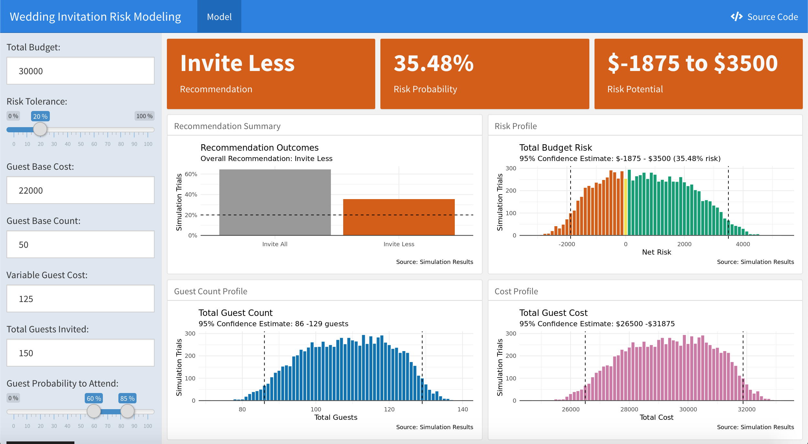

<!-- README.md is generated from README.Rmd. Please edit that file -->

# Wedding Risk Modeling App

## Understand

I will be having a wedding in less than a year and just went through the
process of selecting a venue. Part of the process included fixed and
variable costs that depend on the number of guests that ultimately RSVP
to attend the wedding.

My first question of this process was wondering how many people
ultimately respond to wedding invitations. In other words, of the people
we invite, how many can we expect to attend?

I wondered if there was a better way to quantify the uncertainty of how
many people I can expect to attend, and then turn that into an estimate
of what my budget will be. Additionally, that estimate can be extended
into a risk of going over budget.

## Explore

I looked to combine elements of statistical simulation, risk analytics,
and design thinking to build a product that will extend a single example
use-case into a flexible product that others can use.

Data is generated through the tool using the [Bernoulli
process](https://en.wikipedia.org/wiki/Bernoulli_process) and the user
inputs. Outcomes are based on 10,000 simulation trials.

## Operationalize

I developed a minimum viable product solution as a shiny app using R,
[Shiny](https://shiny.rstudio.com/) and
[flexdashboard](https://rmarkdown.rstudio.com/flexdashboard/).

Links to each are below:

  - Detailed Analysis
  - [Shiny App](https://bclark.shinyapps.io/WeddingRiskModel_App/)

## Contact Information

If you have any questions and/or feedback, please contact me below:

  - [LinkedIn](https://www.linkedin.com/in/bryan-clark-b38470b/)
